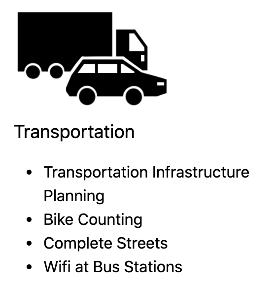

# SmartCityToolkit
Link to site https://cippic-ca.github.io/SmartCityToolkit/

## Adding a new page to your site.
https://help.github.com/en/github/working-with-github-pages/adding-content-to-your-github-pages-site-using-jekyll

### To add a new page to your site. 
1. In the root of your repo, click 'Create new file'.

2. Name your file, making sure to add ".md" to file name.
Example: about-us.md

3. First thing to add to your file will be as follows:
There are two different **layout** to use:
* Default (no sidebar navigation).
* Sidebar-page (this will include a sidebar menu navigation).

**Title** - of the page.
**permalink** - this will allow you create url alias.

4. Add content to page. 

5. Commit file to repo.

## Adding content on your page. 

Markdown is a way to style text on the web. You control the display of the document; formatting words as bold or italic, adding images, and creating lists are just a few of the things we can do with Markdown. Mostly, Markdown is just regular text with a few non-alphabetic characters thrown in, like # or *.

Check out the https://github.com/CIPPIC-CA/SmartCityToolkit/blob/master/Example-text for a full list of markdown text.

For full syntax guide https://guides.github.com/features/mastering-markdown/

## Content for Homepage

Homepage content at top of city scape image, is the only different on where to change the text content and can be edited here https://github.com/CIPPIC-CA/SmartCityToolkit/blob/master/_layouts/homepage.html 
Within the  is where the text can be changed. 
  

Homepage secondary content below the city scape image can be edited here https://github.com/CIPPIC-CA/SmartCityToolkit/blob/master/index.md

## Adding menu items to sidebar navigation
When you have a page with children pages that you would like to display in the sidebar. 

You can edit the file here https://github.com/CIPPIC-CA/SmartCityToolkit/blob/master/_data/toc.yml.
1. To add a new main page, add the title of the page.
2. To add sub pages to new main page, add subfolders with the page name and the page url link to that page.

## Adding menu items to main navigation
Main navigation shown in the header.

To add sub menu items to the header navigation, can be edited on the file here https://github.com/CIPPIC-CA/SmartCityToolkit/blob/master/_data/navigation.yml
1. To add a link to the header navigation, add the name of the page and the link to the page.
2. To add sub pages to the main links, add under sublinks the title and url of the page. 

